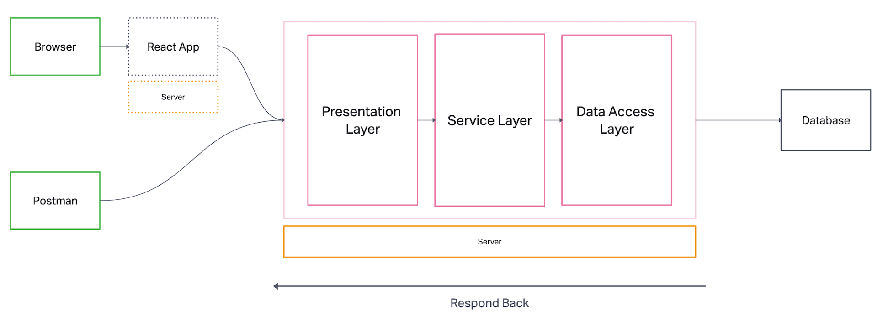
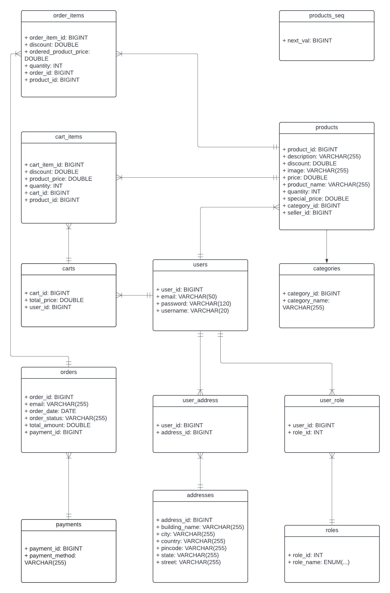

# eCommerce Summary
This project is a backend-only eCommerce application built using Spring Boot. It covers various aspects of an eCommerce platform, including user authentication, product management, order processing, and more.

# High Level Architecture

# Technologies Used
- **Spring Boot**: For building the backend services
- **Spring Security**: For securing the application
- **JWT**: For authentication and authorization
- **JPA/Hibernate**: For database interactions
- **PostgreSQL/MySQL**: As the database
- **AWS**: For deployment

# Project Details
## Roles and User Stories
- **ROLE_USER**: Regular users who can browse products, manage their cart, place orders, and manage their addresses.
- **ROLE_SELLER**: Users with this role can manage their own products, view orders related to their products, and handle shipping.
- **ROLE_ADMIN**: Administrators have full access to all functionalities, including user management, product management, and order processing.
---
- **Address**: Users can manage their shipping addresses
- **Cart**: Users can add, remove, and update items in their shopping cart
- **Auth**: Users can sign up, sign in, and manage their profiles
- **Category**: Products are organized into categories for easier browsing
- **Product**: Users can view product details and search for products
- **Order**: Users can place orders and track their order status

## ERD Diagram

## Key Features
- **User Authentication**: Secure user authentication using JWT
- **Product Management**: CRUD operations for products
- **Order Processing**: Complete order lifecycle management
- **Cart Management**: Add, update, and remove items from the cart
- **Address Management**: Manage user shipping addresses
- **Category Management**: Organize products into categories

# Next Step
Planned future enhancements:
- [ ] Frontend Integration: Develop a frontend to interact with the backend